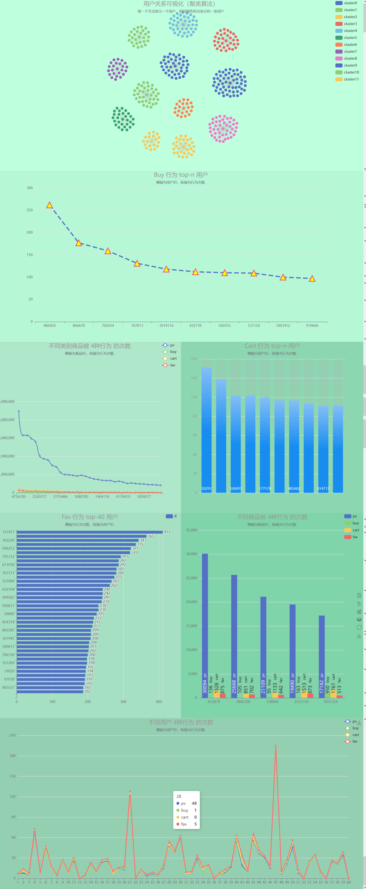

# BigDataProject

小组成员：

| 学号       | 姓名   |
| ---------- | ------ |
| 1800300735 | 汪小龙 |
| 1800300705 | 宁彩云 |
| 1800301204 | 黄毓茹 |
|            |        |
|            |        |
|            |        |

**所选题目：**

User Behavior Data from Taobao for Recommendation：

https://tianchi.aliyun.com/dataset/dataDetail?dataId=649

**数据集描述：**

| 数据集文件       | 数据集描述       | 特征                                     |
| ---------------- | ---------------- | ---------------------------------------- |
| UserBehavior.csv | 所有用户行为数据 | 用户ID、物品ID、范畴ID、行为类型、时间戳 |

**UserBehavior.csv**

随机抽取100万个用户的数据，这些数据包括用户在2017年11月25日至12月3日的点击、购买、加入购物车与物品偏好等行为类型。数据集的组织形式和MovieLens-20M类似，即数据集的每一行表示一条用户行为，由用户ID、商品ID、商品类目ID、行为类型和时间戳组成，并以逗号分隔。各个字段的详细描述如下：

| 列名称     | 说明                                               |
| ---------- | -------------------------------------------------- |
| 用户ID     | 整数类型，序列化后的用户ID                         |
| 商品ID     | 整数类型，序列化后的商品ID                         |
| 商品类目ID | 整数类型，序列化后的商品所属类目ID                 |
| 行为类型   | 字符串，枚举类型，包括('pv', 'buy', 'cart', 'fav') |
| 时间戳     | 行为发生的时间戳                                   |

注意到，用户行为类型共有四种，它们分别是

| 行为类型 | 说明                     |
| -------- | ------------------------ |
| pv       | 商品详情页pv，等价于点击 |
| buy      | 商品购买                 |
| cart     | 将商品加入购物车         |
| fav      | 收藏商品                 |

关于数据集大小的一些说明如下

| 维度         | 数量        |
| ------------ | ----------- |
| 用户数量     | 987,994     |
| 商品数量     | 4,162,024   |
| 用户数量     | 987,994     |
| 商品类目数量 | 9,439       |
| 所有行为数量 | 100,150,807 |
|              |             |

# Requirements

To install the requirements, just input `pip install -r requirements.txt` in the same dir with `requirements.txt`.

```shell
pandas
numpy
scikit-learn
django
```

# Start up

Switch to `/BigDataProject/src/`, then run `python manage.py runserver 0.0.0.0:80` , finally you can see the visual results after inputting `127.0.0.1:80` to your browser. Just as below:



# Code structure description

Download the user behavior dataset from [here](https://tianchi.aliyun.com/dataset/dataDetail?dataId=649), and then unzip it to `./dataset/`.

`./src/` includes source code. We use Django to so visualization problems. The structure of our project is as below:
```shell
|──BigDataProject
|  |──dataset
|  |  └──UserBehavior.csv
|  |
|  |──src
|  |  |──`__pycache__`
|  |  |   └──...
|  |  |
|  |  |──bigdata
|  |  |  |──`__pycache__`
|  |  |  |  └──...
|  |  |  |
|  |  |  |──migrations
|  |  |  |  └──...
|  |  |  |
|  |  |  |──templates
|  |  |  |  └──bigdata
|  |  |  |      |──xxx.html
|  |  |  |      └──index.js
|  |  |  |
|  |  |  |──`__init__.py`
|  |  |  |──admin.py
|  |  |  |──apps.py
|  |  |  |──models.py
|  |  |  |──tests.py
|  |  |  |──urls.py
|  |  |  └──views.py
|  |  |  
|  |  |──config
|  |  |  |──`__pycache__`
|  |  |  |  └──...
|  |  |  |
|  |  |  |──`__init__.py`
|  |  |  |──asgi.py
|  |  |  |──settings.py
|  |  |  |──urls.py
|  |  |  └──wsgi.py
|  |  |  
|  |  |──static
|  |  |  └──...
|  |  |  
|  |  |──database_op.py
|  |  |──dataset_analyze.py
|  |  |──db.sqlite3
|  |  └──manage.py
|  |  
|  |──notebook.ipynb
|  |──README.md
|  └──requirements.txt
```